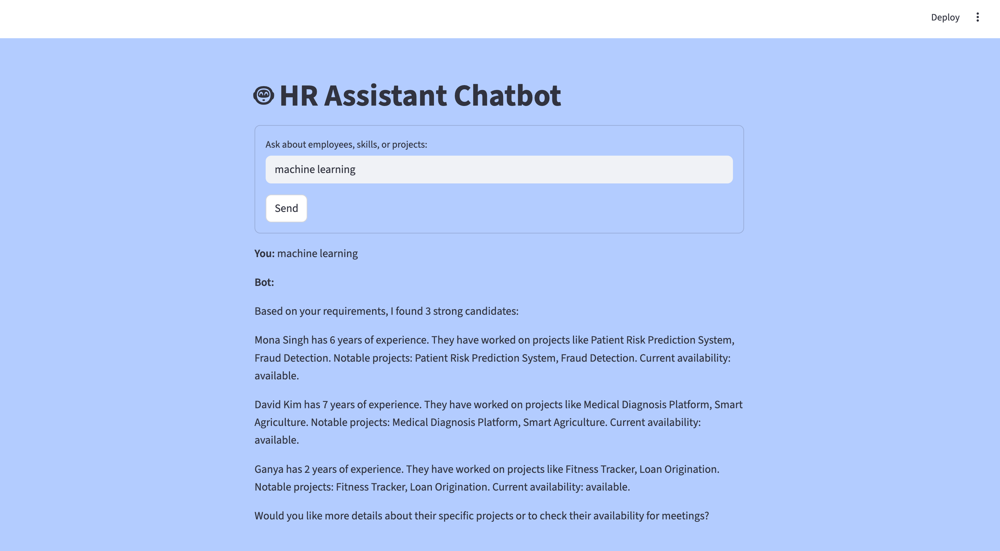

# HR Resource Query Chatbot

## Overview
The HR Resource Query Chatbot is an AI-powered assistant that helps HR teams quickly identify suitable employees using natural language queries. Instead of manually searching through employee records, users can ask questions about skills, experience, projects, or availability.

The system uses **semantic search (RAG)** to retrieve relevant employee profiles and generates clear recommendations using a **local Llama model via Ollama**. The frontend is built with Streamlit while the backend runs on FastAPI.

---

## Features

- Natural language employee search
- Conversational chat interface using Streamlit
- FastAPI backend for query processing
- Semantic search using sentence-transformers
- AI-generated candidate recommendations
- Local LLM inference using **Llama via Ollama**
- Structured API responses
- 30+ employee profiles for testing HR queries

---

## Architecture
```
User (Browser)
   │
   ▼
[Streamlit Frontend]
   │ REST API (POST /chat, GET /employees/search)
   ▼
[FastAPI Backend]
   │
   ├─ RAG Logic (sentence-transformers, semantic search)
   │
   └─ Employee Data (JSON)
   │
   └─ Llama LLM via Ollama (local API)
```
- **Frontend:** Streamlit app for chat, styled with custom CSS
- **Backend:** FastAPI app with endpoints for chat and employee search
- **RAG Logic:** Uses sentence-transformers for embedding queries and employee profiles, retrieves top matches, and generates natural responses using Llama via Ollama
- **Data:** JSON file with 30+ employee profiles

## Setup & Installation
1. **Clone the repository**
2. **Install dependencies**
   ```bash
   pip install -r requirements.txt
   ```
3. **Install Ollama and Llama model**
   - Download and install Ollama: https://ollama.com/download
   - Pull a Llama model (e.g., llama2 ):
     ```bash
     ollama pull llama2
     # or for a newer model
     ollama pull llama3
     ```
   - Start Ollama:
     ```bash
     ollama run llama2
     ```
4. **Run the backend (FastAPI)**
   ```bash
   uvicorn backend.main:app --reload
   ```
5. **Run the frontend (Streamlit)**
   ```bash
   streamlit run frontend/app.py
   ```
**Output (Chat screen)**

## API Documentation
### POST /chat
- **Description:** Chat with the HR assistant
- **Request Body:** `{ "query": "Find Python developers with 3+ years experience" }`
- **Response:**
  ```json
  {
    "response": "Based on your requirements...",
    "employees": [ {"id": 1, "name": "Alice Johnson", ...} ]
  }
  ```

### GET /employees/search
- **Description:** Search employees by skill, experience, project, or availability
- **Query Params:** `skill`, `min_experience`, `project`, `availability`
- **Example:** `/employees/search?skill=Python&min_experience=3`
- **Response:**
  ```json
  [ {"id": 1, "name": "Alice Johnson", ...}, ... ]
  ```

## AI Development Process
- **AI Coding Assistants Used:** Cursor (GPT-4), ChatGPT
- **How AI Helped:**
  - Code generation for FastAPI, Streamlit, and RAG logic
  - Debugging and error resolution (dependency issues, formatting)
  - Architecture suggestions (project structure, API design)
  - UI/UX improvements (CSS, message formatting)
  - **Prompt engineering for Llama/Ollama to produce detailed, comparative, and natural responses**
- **AI vs Hand-written Code:**
  - ~70% of code was AI-assisted, especially for data generation, and formatting
  - Manual intervention for bug fixes, custom logic, and final UI polish
- **Interesting AI Solutions:**
  - Markdown/HTML hybrid formatting for chat bubbles
  - Efficient semantic search using sentence-transformers
  - Advanced prompt design for Llama/Ollama to mimic human-like HR recommendations
- **Manual Challenges:**
  - Handling Streamlit rerun/session state issues
  - Ensuring CSS changes applied correctly in Streamlit

## Technical Decisions
- **Tech Stack:** Python, FastAPI, Streamlit, sentence-transformers, scikit-learn, numpy, Ollama
- **RAG Approach:** Used sentence-transformers for local, fast semantic search (no cloud LLM required)
- **Why Not OpenAI API:**
  - Chose open-source embeddings and local LLMs for cost and privacy
  - No external API keys or cloud costs
- **Local LLM via Ollama:**
  - Local embedding models and Llama LLM are fast and private
  - No data leaves your machine
- **Performance/Cost/Privacy:**
  - All processing is local, so no data leaves your machine
  - Fast response times, no API costs

## Future Improvements
- Add authentication and user management
- Support for uploading custom employee datasets (CSV/Excel)
- Integrate with calendar APIs for meeting scheduling
- Add more advanced LLM-based response generation (OpenAI, Ollama, etc.)
- Improve UI with avatars, chat bubbles, and mobile responsiveness
- Add intelligent AI voice response
- Add analytics dashboard for HR insights

## Troubleshooting
- If you see connection errors, ensure both backend and frontend are running.
- If you see errors connecting to Ollama, make sure Ollama is running and the model is pulled (e.g., `ollama run llama2`).
- For best compatibility, use Python 3.10 or 3.11 and numpy <2.0.
- If UI changes are not visible, refresh your browser and restart Streamlit.

## Notes
- The backend uses sentence-transformers for semantic search (RAG)

- The frontend is a Streamlit chat interface with colored message bubbles and a custom background 
